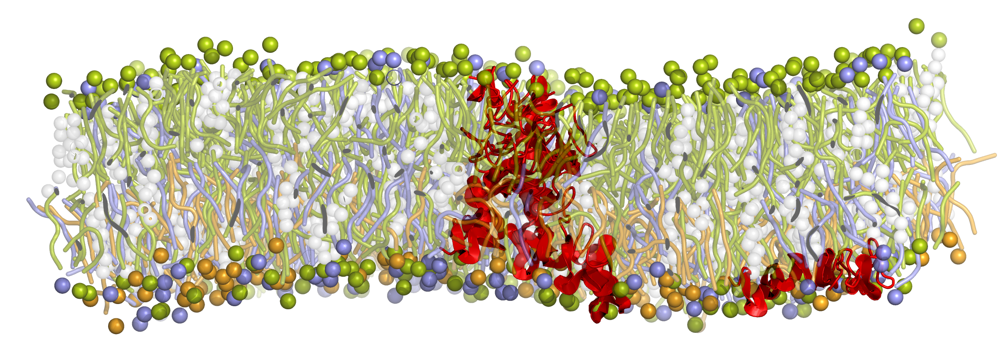
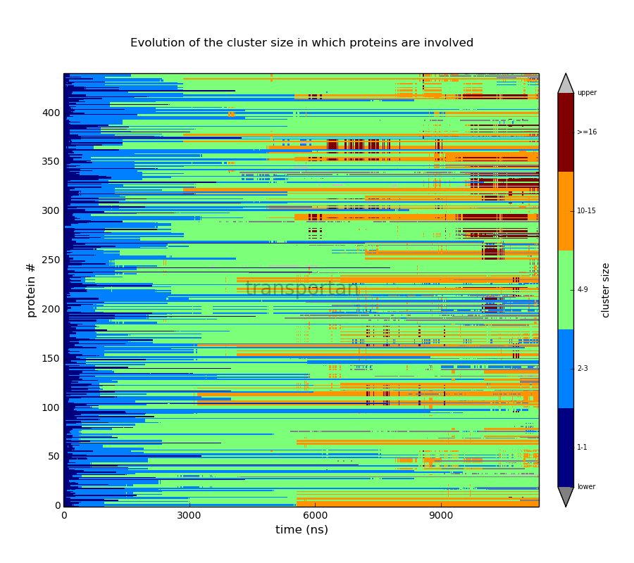

# clusterProt
<h1 align="center">
  
</h1>

A Python script to analyze clustering of membrane proteins.

## Table of content

- [**Description**](#description)
  - [Inputs](#inputs)
  - [Outputs](#outputs)  
- [How to use it](#how-to-use-it)
  - [Requirements](#requirements)
  - [Examples](#examples)
  - [License](#license)
- [How it works](#notes)
  - [Bilayer leaflets](#identifying-bilayer-leaflets)
  - [Flip-flopping lipids](#dealing-with-flip-flopping-lipids)
  - ["Protein" particles](#specifying-"protein"-particles)
  - [Transmembrane clusters](#detecting-transmembrane-clusters)
  - [Visualisation](#visualizing-results)
- [Troubleshooting](#troubleshooting)

## What it does
This script calculates the evolution of proteins clustering status. It can produce 3 types of output:

### Inputs
topology gromacs trajectory

### Outputs
1. snapshot statistics
2. protein interactions
3. cluster composition
4. cluster sizes
5. cluster groups
6. VMD

## How to use it

### Requirements
* networkX
* sklearn
* MDAnalysis
* matplotlib

### Examples

 
```bash
clusterProt -f file.gro -x file.xtc --leaflets
```

### License
Free for... please cite...

## How it works

### Identifying bilayer leaflets

### Dealing with flip-flopping lipids

### Specifying "protein" particles

### Detecting transmembrane clusters

### Specifying size groups

### Visualizing results


## Troubleshooting

 
